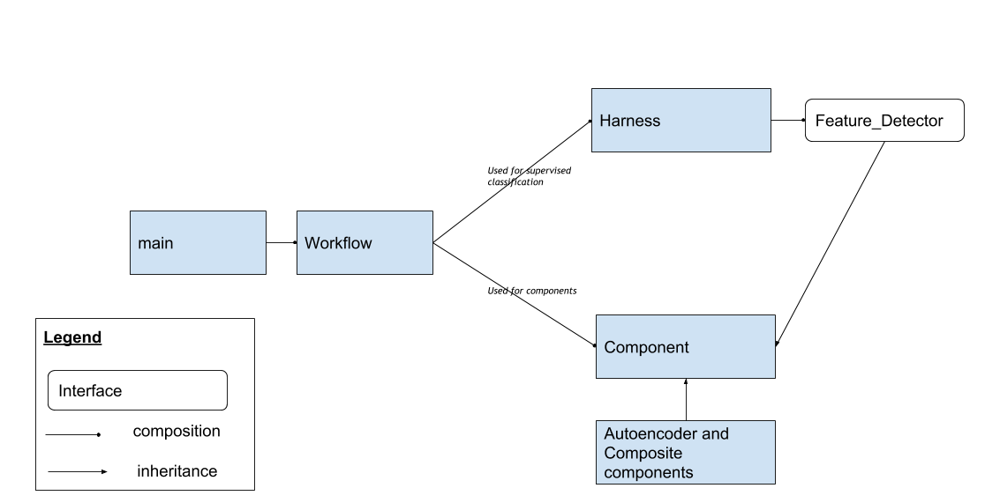

# Project AGI Experimental Framework
A framework based on TensorFlow, developed and maintained by [ProjectAGI](https://agi.io), for building a selective memory system based on convolutional, hierarchical sparse autoencoder-like components.

The objective of this project is to create general purpose Machine Learning algorithms inspired by neuroscience.
Our philosophy is to build components that can learn unsupervised and rely on local (as opposed to long range) 
error signals. 

Terminology:
- A **dataset** is a representation of a dataset using the `tf.data.Dataset` APIs
- A **component** is a TensorFlow graph component - i.e. a fragment of the complete graph. Components may
be nested or composited to build a complete system.
- A **workflow** is the tooling required to train and evaluate components (e.g. training/eval loops, feed_dict building)

The framework comes built-in with multiple datasets (e.g. MNIST, Omniglot, smallNORB), multiple components (e.g. convolutional k-sparse autoencoder), and the base workflow to train and test components. These foundations can be built upon in your own custom projects through class inheritance.

## Prerequisites
- Python 3.6+
- TensorFlow 1.10

We recommend setting up your development environment using [Anaconda](https://www.anaconda.com/).

## Installation
Clone the repository using `git clone https://github.com/ProjectAGI/pagi.git`, then run `pip install -e .` to install
the `pagi` package and its dependencies.

Documentation can be found in the `documentation` directory. A template for the experiment definition file can be found
in `definitions/default-template.json`.

Get comfy, open your favourite Python editor and away you go.

## Architecture

## Usage

### Overview
- The entry point is the `pagi` script, available upon installation
- It instantiates a `Workflow`, `Component` and `Dataset`, and then runs an experiment
- A Workflow describes the setup and conditions of an experiment. The algorithm being tested is represented by the Component, and Datasets are self-explanatory
- The base workflow has a run loop that consists of optionally ‘train’ and ‘test’ steps
- The default is that ‘train’ trains an unsupervised component inheriting Component. The component transforms the input data into a new feature set that is tested in ‘test’ with a supervised classifier using Harness

### Running
- `pagi` provides a number options for how an experiment is run, including setting options for the `Workflow` and for the `Component`
- You can set these options via the command line, or using a `definitions.json` file
- We recommend the `definitions.json` as most convenient (a template is provided in the `definitions` folder)
- Default parameters/hyperparameters are defined in the `Component` and `Workflow` classes respectively
- There are other default experiment parameters defined in `pagi`

### Main Patterns
- Component: A subset of the complete Tensorflow compute graph that acts as an algorithm to test.
- Workflow: Creates and manages the conditions for training and testing a Component.
- Dual: Tensorflow graphs cannot have cycles (loops). Many of our algorithms require recurrent, loopy calculations. To break the loop, we use placeholders to reload updated version of these tensors. The Dual pattern conveniently manages the various forms of a Tensor in its on-graph and off-graph lifecycle, namely: off-graph-numpy-tensor --> placeholder --> on-graph-op --> off-graph numpy result
- Batch types: Tensorflow updates a set of graph vertices in batches. Typically, to update the algorithm completely, many graph ops, with dependent placeholder input and outputs, and summaries - must all be updated simultaneously. The batch-types concept provides a way for components to internalize the complexity of these updates, providing a simpler external interface of supported batch types to choose from.

### Contributing
We encourage people to build and experiment with `pagi`. We are happy to receive pull requests to continue to improve
and expand the codebase.

Our Style Guide can be found here at [./documentation/style-guide](./documentation/style-guide/README.md)

### Testing
Unit tests can be executed in multiple ways:

1. Execute an individual test: `python -m components.autoencoder_component_test`
2. Execute all tests in a specific directory: `python -m unittest discover -s ./components -p '*_test.py'`
3. Execute all the tests in the project: `python -m unittest discover -p '*_test.py'`
