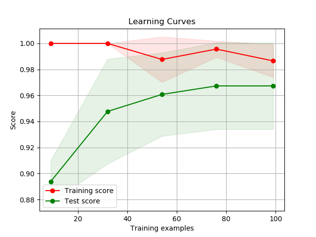

# Classifier
Various algorithms for supervised classification given a matrix of features and
a vector of labels. Evaluates the utility of a pretrained unsupervised network.

# Usage
When training your network:

```
from pagi.classifier.experiment import Experiment
from pagi.classifier.classifier import Classifier
```

Every N batches:

```
experiment = Experiment('mnist', features, labels, num_classes)
experiment.export_data() # Optional, if using later or in separate script
```

(optional args for output folder, filename override etc)
(we could also allow you to specify a dict containing extra stuff to export)

Features should be a matrix of dimension samples x features.
Features is whatever is the state of a hidden network layer or model.
Labels should be a vector containing the label for each sample.
`num_classes` should be the number of unique classes, e.g. if MNIST,
we have digits 0..9 i.e. num_classes = 10.

This export can then be loaded later as it is saved to disk as a compressed
file structure.

We can immediately evaluate the exported data:

```
# Flexible & verbose indexing
split_indices = {
    'train': (0, 60000),
    'test': (60000, 10000)
}

# Optionally, set 'hparams_override' to change hparams
# e.g.: Classifier('svm', hparams_override='C=100,kernel=rbf')
classifier = Classifier('svm')

# Optionally, set 'seed' for setting random seed, and 'verbose' for logging
results = classifier.classify(experiment, split_indices)
```

We can also reload the export in a new program later, and evaluate using the
same code:

```
experiment = Experiment('mnist')
experiment.import_data('/path/to/exported_data_file') # Data now in 'experiment'

classifier = Classifier('svm')
results = classifier.classify(experiment, split_indices)
```

In fact we also have a `main.py` file which allows you to run the classifier
from the command line directly. The following command demonstrates the basic
usage of the `main.py` script using the MNIST dataset:

```
python main.py --data_path=/path/to/output_mnist.h5 --dataset=mnist --model=svm
--train_start=0 --train_len=60000 --test_start=60000 --test_len=10000
```

- Multiple classification models can be used consecutively by specifying them
in a comma separated list, e.g. `--model=svm,logistic`
- The dataset can be shuffled prior to the train/test split using the flag
`--shuffle=true`
- Verbose logging can be enabled using `--verbose=true`

# Result

The following is the structure of the results object returned by the
classifier, which can also be retrieved using the `classifier.get_results()`.

```
# Results structure:
{
    'train': {
        'accuracy': ..
        'f1_score': ..
        'confusion_matrix': ...
    },
    test': {
        'accuracy': ..
        'f1_score': ..
        'confusion_matrix': ...
    }
}
```

The accuracy score, confusion matrix and F1 score can be retrieved via the
results object, or directly via separate getter methods.
```
train_accuracy, test_accuracy = classifier.accuracy_score()
train_cm, test_cm = classifier.confusion_matrix()
train_f1, test_f1 = classifier.f1_score()
```

A classification report can be printed in a more user friendly format
using: `classifier.classification_report(results)`

Multiple classifier instances can be created to evaluate the datasets on
different types of classifiers, e.g. Logistic Regression and SVM.
```
svm_classifier = Classifier('svm')
logistic_classifier = Classifier('logistic')
```

## Learning Curves
Learning curves for the unsupervised component can be easily produced in
TensorBoard by recording the results of the supervised classification every N
batches.



The learning curve for the supervised component can be recorded during the
training of the supervised component by setting the `record_learning_curve=True`
flag in `classifier.classifiy()`.

The learning curve raw statistics which includes training set sizes, training
scores and test scores can be retrieved using `classifier.get_learning_curve()`.

The learning curve can also be plotted using `classifier.plot_learning_curve()`,
which returns the matplotlib figure and saves the figure to disk.
